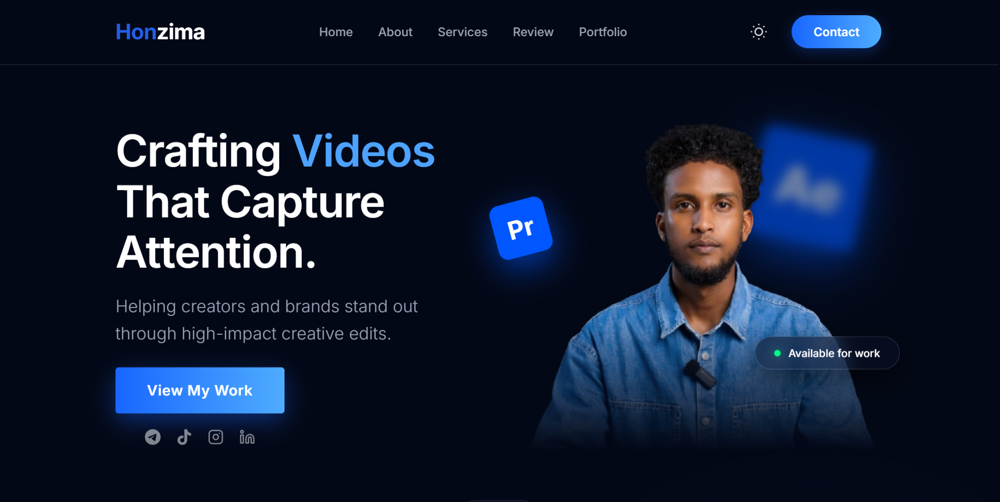

# Honzima Site V2

[](https://react.dev/)
[](https://www.typescriptlang.org/)
[](https://vitejs.dev/)
[](https://supabase.com/)
[](https://opensource.org/licenses/MIT)

A premium, institutional-grade creative portfolio website designed for high-conversion and seamless user experience.



---

## 📖 Table of Contents
- [Project Overview](#-project-overview)
- [Key Features](#-key-features)
- [Tech Stack](#-tech-stack)
- [Project Structure](#-project-structure)
- [Setup Instructions](#-setup-instructions)
- [Admin Access](#-admin-access)
- [License](#-license)

---

## ✨ Project Overview
Honzima Site V2 is a high-fidelity portfolio platform featuring interactive animations, dual-theme support, and a robust backend integration for content management. It is designed to showcase creative work with a premium "Electric Blue" aesthetic and institutional clarity.

## 🚀 Key Features
- **Premium Hero Section**: High-impact introduction with fluid visual elements.
- **Asymmetrical Services Grid**: Modern, dynamic layout for showcasing service offerings.
- **Interactive Process Roadmap**: A high-fidelity visualization of the creative workflow.
- **Featured Works Portfolio**: Seamlessly managed project gallery with dynamic filtering.
- **Client Testimonials**: Integration of client feedback to build trust and authority.
- **Dual Theme Engine**: Polished Dark and Light modes for optimized readability and aesthetic preference.
- **Secure Admin Dashboard**: A specialized portal for managing "Featured Works" and testimonials, powered by Supabase.
- **Fully Responsive**: Optimized for excellence across all device sizes, from mobile to desktop.

## 🛠 Tech Stack
- **Frontend**: [React 19](https://react.dev/), [TypeScript](https://www.typescriptlang.org/), [Vite](https://vitejs.dev/)
- **Styling**: Vanilla CSS with [CSS Modules](https://github.com/css-modules/css-modules) for component-level scoping.
- **Backend / Database**: [Supabase](https://supabase.com/) for secure authentication and data storage.
- **Routing**: [React Router](https://reactrouter.com/) for single-page application navigation.

## 📂 Project Structure
```text
HonzimaSiteV2/
├── public/              # Static assets (images, icons, mockup)
├── src/
│   ├── components/      # Reusable UI components (Hero, Nav, Footer, etc.)
│   ├── pages/           # Page-level components (Admin, AllProjects)
│   ├── lib/             # Supabase client and utility libraries
│   ├── assets/          # Project-specific assets (global CSS, images)
│   ├── App.tsx          # Main application entry and routing
│   └── main.tsx         # Root rendering logic
├── .env                 # Environment variables (Ignored by Git)
├── vite.config.ts       # Vite configuration
└── tsconfig.json        # TypeScript configuration
```

## ⚙️ Setup Instructions

### Prerequisites
- Node.js (Latest LTS recommended)
- NPM or Yarn

### Local Development
1. **Clone the repository**:
   ```bash
   git clone <repository-url>
   cd HonzimaSiteV2
   ```

2. **Install dependencies**:
   ```bash
   npm install
   ```

3. **Configure Environment Variables**:
   Create a `.env` file in the root directory and add your Supabase credentials:
   ```env
   VITE_SUPABASE_URL=your-supabase-url
   VITE_SUPABASE_ANON_KEY=your-supabase-anon-key
   ```

4. **Start the development server**:
   ```bash
   npm run dev
   ```

### Building for Production
To generate a production build, run:
```bash
npm run build
```
The output will be located in the `dist` directory.

## 🔐 Admin Access
The administrative dashboard is accessible at `/admin`. It requires authentication via Supabase and allows for real-time updates to the portfolio's content.

